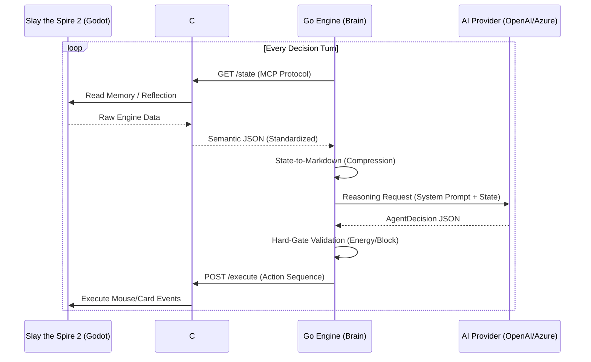

# System Architecture: Senses-Brain Decoupling 模型
# 系统架构：感官-大脑解耦模型

[English](#english) | [中文](#chinese)

---

## 🇬🇧 English: System Overview

The **STS2-Agent-Pro** architecture is divided into two primary layers: the **Senses Layer (C# Mod)** and the **Brain Layer (Go Engine)**. This separation ensures that low-level game engine interactions do not interfere with high-level cognitive reasoning.

### 1. High-Level Workflow

### 2. Core Components
- **C# Mod (STS2-Agent)**: Injected into the Godot environment. It acts as the physical interface, handling memory reading, game state monitoring, and action execution via native calls.
- **Go Engine (Brain)**: The orchestrator. It manages the lifecycle of the AI agent, handles API communications, and performs state abstraction to minimize token usage.
- **MCP Bridge**: The Model Context Protocol ensures that the JSON structure provided to the Brain is consistent across different versions of the game engine.

---

## 🇨🇳 中文：系统概览

**STS2-Agent-Pro** 的架构分为两个核心层：**感官层 (C# Mod)** 与 **大脑层 (Go Engine)**。这种解耦设计确保了底层的游戏引擎交互不会干扰高层的认知推理。

### 1. 核心工作流
如上方的 Mermaid 序列图所示，智能体在每个决策回合都会经历：**状态提取 -> 语义压缩 -> 逻辑推理 -> 硬性校验 -> 指令执行** 的闭环。

### 2. 核心组件
- **C# Mod (STS2-Agent)**: 注入 Godot 运行环境。作为物理接口，负责通过反射（Reflection）读取内存、监控游戏状态，并通过原生调用执行鼠标/卡牌事件。
- **Go Engine (Brain)**: 协调中枢。管理 AI 智能体的生命周期，处理 API 通信，并将复杂的原始状态抽象为语义化的 Markdown 文本，以最小化 Token 消耗。
- **MCP 桥接层**: 模型上下文协议确保了提供给“大脑”的 JSON 结构在不同游戏引擎版本间保持一致。

### 3. 数据压缩策略 (State Reduction)
为了降低推理成本，Go Engine 会对原始 JSON 进行语义化提取：
- **静态过滤**: 排除与当前决策无关的 UI 元素信息。
- **差异增量**: 仅在状态发生显著变化（如进入新楼层、抽牌）时才发送完整上下文。
- **Markdown 转化**: 将列表结构转化为 Markdown 表格，利用 LLM 对 Markdown 的天然亲和性提升推理精度。
